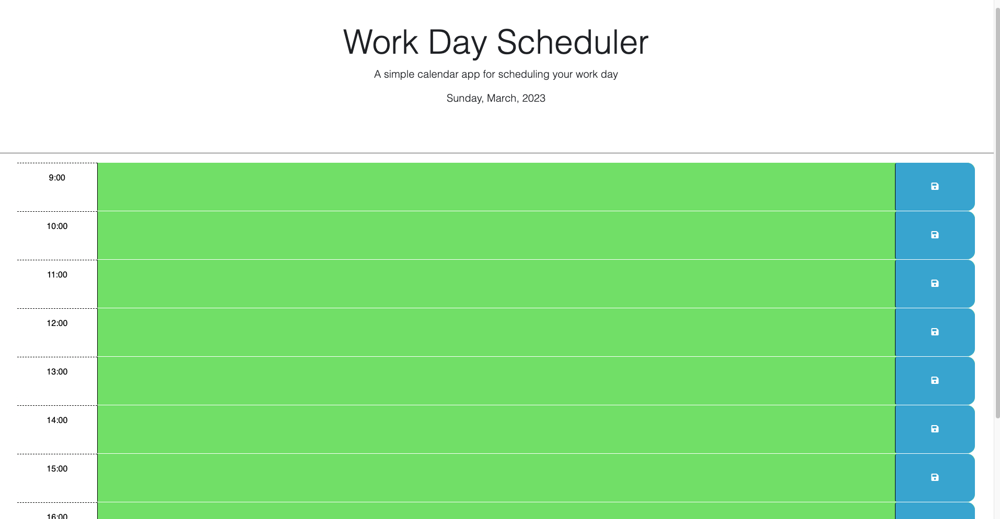

# Day Planner

[](https://opensource.org/licenses/MIT)

## Links

- The repo of the note app: [Source Code]()

- Here is the link of live demo app: [Demo]()

## Description 🔎

a simple calendar application that allows a user to save events for each hour of the day

## Table of Contents 📖

- [Usage](#usage-🔑)
- [License](#license-📝)
- [Mock up](#mock-up)
- [Things I Learned](#things-i-learned-📚)
- [RoadMap](#roadmap-🧭)

## Usage 🔑

```md
GIVEN I am using a daily planner to create a schedule
WHEN I open the planner
THEN the current day is displayed at the top of the calendar
WHEN I scroll down
THEN I am presented with timeblocks for standard business hours
WHEN I view the timeblocks for that day
THEN each timeblock is color coded to indicate whether it is in the past, present, or future
WHEN I click into a timeblock
THEN I can enter an event
WHEN I click the save button for that timeblock
THEN the text for that event is saved in local storage
WHEN I refresh the page
THEN the saved events persist
```

## License 📝

'click the license badge at the beginning of the document to get more info'

## Mock-Up



## Things I Learned 📚

- `Learned about jQuery`
- `Local Storage`
- `Dayjs`

### RoadMap 🧭

- `Updates to the UI "prettier" and more responsive`
- `Refactor code to be more efficient`
